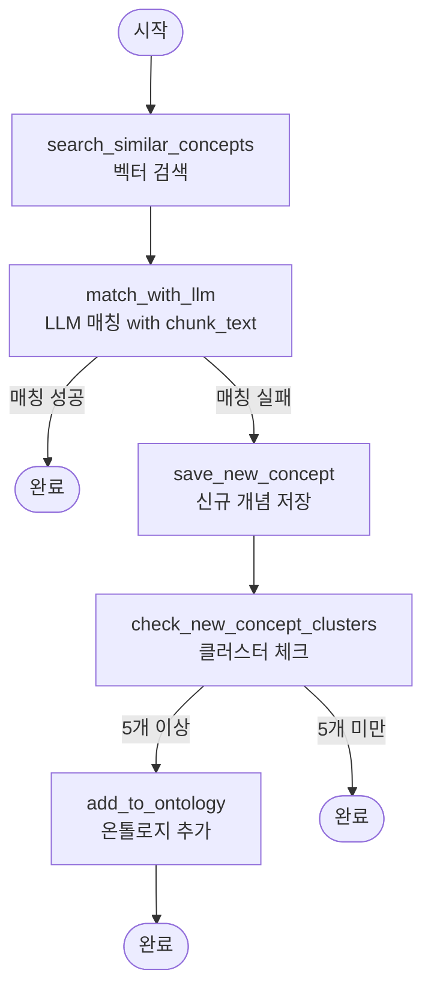

# Ontology Package

온톨로지 관리 패키지. GraphDB를 사용한 그래프 데이터베이스 쿼리 및 문서-온톨로지 매핑 기능을 제공합니다.

## 구조

```
ontology/
├── pyproject.toml
├── README.md
├── setup_graphdb.sh                     # GraphDB 초기 세팅
├── run_document_ontology_mapping.sh     # 메인 실행 스크립트
├── example_input.jsonl                  # 예제 입력 파일
├── data/
│   └── llm_ontology.ttl                 # 초기 온톨로지 스키마 (읽기 전용)
├── backups/                             # Graph DB 백업 (최근 10개)
│   └── graphdb_*.ttl
├── snapshots/                           # ChromaDB 스냅샷 (최근 10개)
│   └── chromadb_v*.tar.gz
├── db/
│   ├── vector_store/                    # ChromaDB 데이터
│   └── new_concepts.db                  # 신규 개념 임시 저장
└── src/
    ├── storage/                         # 저장소 계층
    │   ├── graph_query_engine.py       # Graph DB (SPARQL)
    │   ├── vector_store.py              # Vector DB (ChromaDB)
    │   └── new_concept_manager.py       # SQLite (신규 개념 임시 저장)
    ├── pipeline/                       # 처리 파이프라인
    │   ├── document_ontology_mapper.py # LangGraph 워크플로우
    │   ├── concept_matcher.py          # LLM 기반 개념 매칭
    │   ├── ontology_updater.py         # 온톨로지 업데이트
    │   └── relation_builder.py         # Source 기반 관계 추가
    ├── backup/                         # 백업/동기화
    │   ├── graph_backup.py             # Graph DB 백업
    │   ├── chromadb_sync.py            # Graph DB ↔ ChromaDB 동기화
    │   └── chromadb_snapshot.py       # ChromaDB 스냅샷 관리
    ├── utils.py                        # 공통 유틸리티 (TTL 파싱 등)
    └── scripts/                        # 실행 스크립트
        ├── main.py                     # JSONL 처리 메인 로직
        ├── initialize_vector_db.py     # Vector DB 초기화
        └── add_new_concept.py          # 단일 개념 추가
```

## 주요 기능

### 1. GraphDB 시작 (초기 세팅)

GraphDB 도커 컨테이너를 시작하고 온톨로지를 로드합니다.

```bash
cd dev/packages/ontology
./setup_graphdb.sh
```

두 스크립트 모두 다음 작업을 자동으로 수행합니다:
1. GraphDB 도커 컨테이너 시작 (포트 7200)
2. Repository 생성 (`llm-ontology`)
3. `data/llm_ontology.ttl` 온톨로지 파일 로드
4. 데이터 로드 검증

스크립트 실행 후:
- GraphDB UI: http://localhost:7200
- SPARQL Endpoint: http://localhost:7200/repositories/llm-ontology

컨테이너 관리:
```bash
# 컨테이너 중지
docker stop graphdb-ontology

# 컨테이너 재시작
docker start graphdb-ontology

# 컨테이너 제거
docker rm -f graphdb-ontology
```

### 2. Vector DB 초기화

온톨로지의 모든 개념에 대한 description을 생성하고 Vector DB를 초기화합니다.

```bash
cd dev/packages/ontology
python scripts/initialize_vector_db.py
```

이 스크립트는 다음 작업을 수행합니다:
1. `data/llm_ontology.ttl`에서 모든 개념 로드
2. Description이 비어있는 개념들에 대해 LLM으로 설명 생성
3. TTL 파일에 description 업데이트
4. ChromaDB Vector Store 초기화 및 모든 개념 임베딩 저장

**주의**: 이 작업은 OpenAI API를 사용하므로 `OPENAI_API_KEY` 환경 변수가 설정되어 있어야 합니다.

Vector DB 경로:
- `db/vector_store/` - ChromaDB 데이터 저장 위치

### 3. 새 개념 추가

새로운 개념을 Graph DB, Vector DB, TTL 파일에 동시에 추가합니다.

```bash
cd dev/packages/ontology
python scripts/add_new_concept.py <concept_id> <label> <parent> [--description DESC]
```

예시:
```bash
# Description을 LLM이 자동으로 생성
python scripts/add_new_concept.py "LoRA" "Low-Rank Adaptation" "FineTuning"

# Description을 직접 지정
python scripts/add_new_concept.py "LoRA" "Low-Rank Adaptation" "FineTuning" \
  --description "대규모 언어 모델을 효율적으로 파인튜닝하기 위한 저랭크 어댑테이션 기법"

# TTL 파일 업데이트 생략 (Graph DB와 Vector DB만 업데이트)
python scripts/add_new_concept.py "LoRA" "Low-Rank Adaptation" "FineTuning" --skip-ttl
```

이 스크립트는 다음 작업을 수행합니다:
1. Description 생성 (지정하지 않으면 LLM이 자동 생성)
2. **Graph DB에 추가** (SPARQL INSERT)
3. **Vector DB에 추가** (임베딩 생성 및 저장)
4. **TTL 파일에 추가** (영속성 보장, `--skip-ttl` 옵션으로 생략 가능)

### 4. SPARQL 쿼리

GraphDB에 SPARQL 쿼리를 실행합니다.

```python
from ontology import GraphQueryEngine

engine = GraphQueryEngine("http://localhost:7200/repositories/repo")
result = engine.query("SELECT * WHERE { ?s ?p ?o }")
```

### 5. 백업 및 스냅샷 관리

**자동 백업 (Graph DB + ChromaDB):**
```bash
# run_document_ontology_mapping.sh 실행 시 자동으로 백업
./run_document_ontology_mapping.sh --input concepts.jsonl

# 백업 생략
./run_document_ontology_mapping.sh --input concepts.jsonl --skip-backup
```

백업 파일:
- Graph DB: `backups/graphdb_YYYYMMDD_HHMMSS.ttl` (최근 10개 유지)
- ChromaDB: `snapshots/chromadb_v{N}_YYYYMMDD_HHMMSS.tar.gz` (최근 10개 유지)

**수동 백업/스냅샷:**
```python
from backup import create_backup, create_snapshot

# Graph DB 백업
create_backup("http://localhost:7200/repositories/llm-ontology", "backups")

# ChromaDB 스냅샷
create_snapshot("db/vector_store", "snapshots")
```

**복원:**
```python
from backup import restore_snapshot
restore_snapshot("snapshots/chromadb_v1_20251226.tar.gz", "db/vector_store")
```

### 6. Vector 유사도 검색

Vector DB를 사용하여 유사한 개념을 검색합니다.

```python
from ontology import VectorStore

vector_store = VectorStore("db/vector_store")

results = vector_store.find_similar("attention mechanism", k=5)
for result in results:
    print(f"{result['concept_id']}: {result['description']}")
    print(f"  Distance: {result['distance']}\n")
```

### 7. 사용 예시

**테스트 실행:**
```bash
cd dev/packages/ontology

# 예제 JSONL 파일로 테스트
./run_document_ontology_mapping.sh --input example_input.jsonl

# 백업 생략
./run_document_ontology_mapping.sh --input example_input.jsonl --skip-backup
```

**Python 코드에서 사용:**
```python
from storage import GraphQueryEngine, VectorStore
from backup import (
    sync_graphdb_to_chromadb,
    create_backup,
    create_snapshot
)

# 백업
create_backup("http://localhost:7200/repositories/llm-ontology", "backups")

# 동기화
graph_engine = GraphQueryEngine("http://localhost:7200/repositories/llm-ontology")
vector_store = VectorStore("db/vector_store")
sync_graphdb_to_chromadb(graph_engine, vector_store)

# 스냅샷
create_snapshot("db/vector_store", "snapshots")
```

### 8. 문서-온톨로지 매핑 (고급)

```python
from ontology import (
    GraphQueryEngine,
    VectorStore,
    ConceptMatcher,
    NewConceptManager,
    OntologyUpdater,
    DocumentOntologyMapper,
)

# 컴포넌트 초기화
graph_engine = GraphQueryEngine("http://localhost:7200/repositories/repo")
vector_store = VectorStore("path/to/vector_db")
concept_matcher = ConceptMatcher(vector_store)
new_concept_manager = NewConceptManager("path/to/new_concepts.db")
ontology_updater = OntologyUpdater(graph_engine)

# 매퍼 생성
mapper = DocumentOntologyMapper(
    graph_engine=graph_engine,
    vector_store=vector_store,
    concept_matcher=concept_matcher,
    new_concept_manager=new_concept_manager,
    ontology_updater=ontology_updater,
)

# 키워드 매핑
keywords = ["machine learning", "neural network"]
result = mapper.map_keywords(keywords, chunk_id="chunk_001")
```

#### 문서-온톨로지 매핑 워크플로우

`DocumentOntologyMapper`는 LangGraph를 사용하여 문서에서 추출한 개념을 온톨로지에 매핑합니다.

##### 워크플로우 그래프



##### 상태 구조 (MappingState)

```python
{
    "concept": str,                  # 입력 개념 (필수)
    "chunk_text": str,               # 원본 텍스트 (필수)
    "source": str,                   # 출처 (section_id 기반 자동 생성)
    "metadata": Dict[str, Any],      # 추가 메타데이터 (section_id, section_title 등)
    "matched_concept_id": str,       # 매칭된 개념 ID
    "is_new": bool,                  # 신규 개념 여부
    "candidates": List[Dict]         # 벡터 검색 후보들
}
```

**입력 JSONL 필수 필드:**
- `concept`: 개념 이름
- `section_id`: 섹션 ID (관계 생성에 사용)
- `section_title`: 섹션 제목
- `chunk_text`: 원본 텍스트

**입력 JSONL 선택 필드:**
- `source`: 출처 (없으면 `section_{section_id}`로 자동 생성)
- `chapter_id`, `chapter_title`, `book_id`, `book_title` 등

##### 노드별 상세 설명

1. **search_similar_concepts** (벡터 검색)
   - 개념에 대해 ChromaDB에서 k개 유사 개념 검색
   - BAAI/bge-m3 모델로 임베딩 생성
   - 유사도 기반으로 후보 개념 리스트 생성
   - 결과를 `candidates`에 저장

2. **match_with_llm** (LLM 매칭)
   - 개념, chunk_text, 후보 개념들을 LLM에 전달
   - LLM이 원본 텍스트 맥락을 고려하여 최종 매칭 판단
   - 매칭 성공: `matched_concept_id` 설정, 워크플로우 종료
   - 매칭 실패: `is_new = True`, 다음 노드로 진행

3. **save_new_concept** (신규 개념 저장)
   - 매칭 실패한 개념을 신규 개념으로 SQLite DB에 저장
   - 개념명, chunk_text, source 저장
   - 나중에 클러스터링을 위해 임시 보관

4. **check_new_concept_clusters** (클러스터 체크)
   - 신규 개념 DB에서 유사한 개념들을 클러스터링
   - 5개 이상의 유사 개념이 묶인 클러스터 확인
   - 클러스터가 있으면 온톨로지 추가 진행

5. **add_to_ontology** (온톨로지 추가)
   - 5개 이상 묶인 신규 개념 클러스터를 온톨로지에 추가
   - LLM을 사용하여 적절한 부모 개념 결정
   - Graph DB와 ChromaDB에 동시 추가
   - 신규 개념 DB에서 해당 개념들 제거

##### 데이터 흐름

```
JSONL 입력 (concept + section_id + section_title + chunk_text + 옵션 필드)
    ↓
각 개념별로:
    ↓
[벡터 검색] → 후보 개념들
    ↓
[LLM 매칭 with chunk_text] → 매칭 성공/실패
    ↓
매칭 성공 → 완료
    ↓
매칭 실패 → [신규 개념 저장] → [클러스터 체크]
    ↓
5개 이상 → [온톨로지 추가] → 완료
    ↓
5개 미만 → 완료
    ↓
모든 개념 처리 완료 후:
    ↓
[Section ID별 그룹화하여 Related 관계 추가]
```

##### 주요 특징

- **2단계 매칭**: 벡터 검색 + LLM 매칭 (원본 텍스트 맥락 활용)
- **신규 개념 관리**: 매칭 실패한 개념을 임시 저장하고 클러스터링
- **자동 온톨로지 확장**: 5개 이상 유사 개념이 모이면 자동으로 온톨로지에 추가
- **Section 기반 관계**: 같은 section_id를 가진 개념들 간 자동으로 related 관계 생성
- **Weight 관리**: 동일 관계가 반복되면 weight 증가
- **자동 백업**: 실행 시마다 Graph DB 자동 백업
- **동기화**: Graph DB와 ChromaDB 자동 동기화

## 개념 관리 워크플로우

### 초기 설정 (처음 한 번만)

1. **환경 설정**
   ```bash
   cd dev/packages/ontology
   uv sync
   
   # Bruno API 사용 시
   export OPENAI_API_BASE="http://bruno.maas.navercorp.com/v1"
   export OPENAI_API_KEY="your-bruno-api-key"
   export OPENAI_MODEL="gpt-4o-mini"  # 선택사항 (기본값: gpt-4o-mini)
   
   # OpenAI API 사용 시
   # export OPENAI_API_KEY="your-openai-api-key"
   # export OPENAI_MODEL="gpt-4o"  # 선택사항
   ```

2. **GraphDB 시작**
   ```bash
   ./setup_graphdb.sh
   ```

3. **Graph DB ↔ ChromaDB 동기화 (초기 설정)**
   ```bash
   ./run_document_ontology_mapping.sh --sync-only
   ```

### JSONL 배치 처리 (권장)

**JSONL 입력 형식:**
```jsonl
{"concept": "LoRA", "section_id": 2, "section_title": "What is an LLM twin?", "chunk_text": "LoRA는 대규모 언어 모델을...", "chapter_id": 6, "chapter_title": "Chapter 1", "book_id": 1}
{"concept": "QLoRA", "section_id": 2, "section_title": "What is an LLM twin?", "chunk_text": "QLoRA는 양자화된...", "chapter_id": 6, "chapter_title": "Chapter 1", "book_id": 1}
```

**필수 필드:**
- `concept`: 개념 이름
- `section_id`: 섹션 ID (같은 section_id의 개념들끼리 related 관계 생성)
- `section_title`: 섹션 제목
- `chunk_text`: 개념이 추출된 원본 텍스트

**선택 필드:** 
- `source`: 출처 (없으면 `section_{section_id}`로 자동 생성)
- `chapter_id`, `chapter_title`: 챕터 정보
- `book_id`, `book_title`: 책 정보
- `key_idea_id`, `chunk_id` 등 기타 메타데이터

**실행:**
```bash
# 기본 실행 (백업 + 동기화 + 처리)
./run_document_ontology_mapping.sh --input concepts.jsonl

# 백업 생략 (Graph DB + ChromaDB)
./run_document_ontology_mapping.sh --input concepts.jsonl --skip-backup

# 동기화만 실행
./run_document_ontology_mapping.sh --sync-only
```

### 플로우 다이어그램

```
JSONL 입력
    ↓
┌─────────────────────────────────┐
│ 1. Graph DB 백업 (자동)          │
│ 2. Graph DB ↔ ChromaDB 동기화    │
└─────────────────────────────────┘
    ↓
각 개념별 처리:
    ↓
[Vector 유사도 검색]
    ↓
[LLM 매칭 (chunk_text 포함)]
    ↓
매칭 성공 → 완료
    ↓
매칭 실패 → [신규 개념 저장]
    ↓
[클러스터 체크 (5개 이상?)]
    ↓
Yes → [온톨로지에 추가]
    ↓
모든 개념 처리 완료
    ↓
[Section ID별 그룹화하여 Related 관계 추가]
    ↓
┌─────────────────────────────────┐
│ Graph DB: 개념 + 관계 저장       │
│ ChromaDB: 임베딩 저장            │
│ Snapshots: 버전 관리 (선택)      │
└─────────────────────────────────┘
```

## 설치

```bash
cd dev/packages/ontology
uv sync
```

## 의존성

- `chromadb>=0.4` - 벡터 DB
- `sentence-transformers` - 임베딩 모델 (BAAI/bge-m3)
- `langchain>=0.3` - LangChain
- `langgraph` - LangGraph
- `rdflib` - RDF 처리
- `SPARQLWrapper` - SPARQL 쿼리
- `psycopg2-binary` - PostgreSQL 연결
- `docker` - 도커 컨테이너 관리

## 주요 특징

### 데이터 관리 전략

1. **Graph DB (단일 진실 소스)**
   - 모든 개념과 관계는 Graph DB에 저장
   - `data/llm_ontology.ttl`은 초기 스키마만 (동적 업데이트 안 함)
   - 실행 시마다 자동 백업 (`backups/` 디렉토리)

2. **ChromaDB (검색 최적화)**
   - Graph DB와 자동 동기화
   - BAAI/bge-m3 모델 사용 (8192 토큰, 100+ 언어)
   - 스냅샷으로 버전 관리 (`snapshots/` 디렉토리)

3. **백업 및 버전 관리**
   - Graph DB: 실행 시마다 TTL export (최근 10개 유지)
   - ChromaDB: 실행 시마다 tar.gz 스냅샷 (최근 10개 유지)
   - 모든 백업/스냅샷은 Git에서 제외 (.gitignore)

