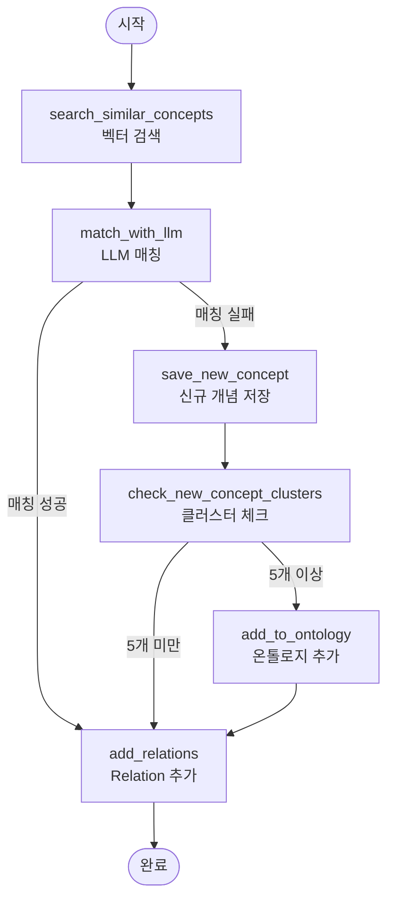

# Ontology Package

온톨로지 관리 패키지. GraphDB를 사용한 그래프 데이터베이스 쿼리 및 문서-온톨로지 매핑 기능을 제공합니다.

## 구조

```
ontology/
├── pyproject.toml
├── README.md
├── src/
│   └── ontology/
│       ├── __init__.py
│       ├── graph_query_engine.py      # SPARQL 쿼리 엔진
│       ├── vector_store.py            # ChromaDB 벡터 스토어
│       ├── concept_matcher.py         # LLM 기반 개념 매칭
│       ├── new_concept_manager.py     # 신규 개념 관리 (SQLite)
│       ├── ontology_updater.py       # 온톨로지 업데이트
│       ├── document_ontology_mapper.py # LangGraph 플로우 오케스트레이터
│       └── utils.py                   # 공통 유틸리티
└── scripts/
    └── start_graph_db.py              # GraphDB 도커 시작 스크립트
```

## 주요 기능

### 1. GraphDB 시작

TTL 파일 경로를 지정하여 GraphDB 도커 컨테이너를 시작합니다.

```python
from ontology.scripts.start_graph_db import start_graph_db

start_graph_db("path/to/ontology.ttl", port=7200)
```

### 2. SPARQL 쿼리

GraphDB에 SPARQL 쿼리를 실행합니다.

```python
from ontology import GraphQueryEngine

engine = GraphQueryEngine("http://localhost:7200/repositories/repo")
result = engine.query("SELECT * WHERE { ?s ?p ?o }")
```

### 3. 문서-온톨로지 매핑

문서에서 추출한 키워드를 온톨로지에 매핑합니다.

```python
from ontology import (
    GraphQueryEngine,
    VectorStore,
    ConceptMatcher,
    NewConceptManager,
    OntologyUpdater,
    DocumentOntologyMapper,
)

# 컴포넌트 초기화
graph_engine = GraphQueryEngine("http://localhost:7200/repositories/repo")
vector_store = VectorStore("path/to/vector_db")
concept_matcher = ConceptMatcher(vector_store)
new_concept_manager = NewConceptManager("path/to/new_concepts.db")
ontology_updater = OntologyUpdater(graph_engine)

# 매퍼 생성
mapper = DocumentOntologyMapper(
    graph_engine=graph_engine,
    vector_store=vector_store,
    concept_matcher=concept_matcher,
    new_concept_manager=new_concept_manager,
    ontology_updater=ontology_updater,
)

# 키워드 매핑
keywords = ["machine learning", "neural network"]
result = mapper.map_keywords(keywords, chunk_id="chunk_001")
```

#### 문서-온톨로지 매핑 워크플로우

`DocumentOntologyMapper`는 LangGraph를 사용하여 문서에서 추출한 키워드를 온톨로지에 매핑하는 전체 프로세스를 오케스트레이션합니다.

##### 워크플로우 그래프



##### 상태 구조 (MappingState)

```python
{
    "keywords": List[str],           # 입력 키워드 리스트
    "chunk_id": str,                 # 문서 청크 ID
    "matched_concepts": List[Dict],  # 매칭된 기존 개념들
    "new_concepts": List[Dict],      # 신규 개념들
    "relations": List[Dict],         # 추가할 관계들
    "candidates": List[Dict]         # 벡터 검색 후보들
}
```

##### 노드별 상세 설명

1. **search_similar_concepts** (벡터 검색)
   - 각 키워드에 대해 ChromaDB에서 k개 유사 개념 검색
   - 온톨로지의 모든 개념 description을 벡터화하여 저장
   - 유사도 기반으로 후보 개념 리스트 생성
   - 결과를 `candidates`에 저장

2. **match_with_llm** (LLM 매칭)
   - 각 키워드와 후보 개념들을 LLM에 전달
   - LLM이 최종 매칭 여부와 매칭된 개념 결정
   - 매칭 성공: `matched_concepts`에 추가
   - 매칭 실패: `new_concepts`에 추가

3. **save_new_concept** (신규 개념 저장)
   - 매칭 실패한 키워드를 신규 개념으로 SQLite DB에 저장
   - 키워드, description, chunk_id 저장
   - 나중에 클러스터링을 위해 임시 보관

4. **check_new_concept_clusters** (클러스터 체크)
   - 신규 개념 DB에서 유사한 개념들을 클러스터링
   - 5개 이상의 유사 개념이 묶인 클러스터 확인
   - 클러스터가 있으면 온톨로지 추가 후보로 표시

5. **add_to_ontology** (온톨로지 추가)
   - 5개 이상 묶인 신규 개념 클러스터를 온톨로지에 추가
   - LLM을 사용하여 적절한 부모 개념 결정
   - GraphDB에 새로운 개념과 관계 추가
   - 신규 개념 DB에서 해당 개념들 제거

6. **add_relations** (Relation 추가)
   - 동일한 청크에서 뽑힌 모든 개념들 간에 `llm:related` 관계 추가
   - A - related - B, B - related - A 양방향 관계 생성
   - 이미 존재하는 relation이면 weight 증가
   - GraphDB에 triple 추가 또는 업데이트

##### 데이터 흐름

```
문서 키워드
    ↓
[벡터 검색] → 후보 개념들 (candidates)
    ↓
[LLM 매칭] → 매칭 성공/실패 분기
    ↓
매칭 성공 → [Relation 추가] → 완료
    ↓
매칭 실패 → [신규 개념 저장] → [클러스터 체크]
    ↓
5개 이상 → [온톨로지 추가] → [Relation 추가] → 완료
    ↓
5개 미만 → [Relation 추가] → 완료
```

##### 주요 특징

- **2단계 매칭**: 벡터 검색으로 후보를 줄이고, LLM으로 최종 결정
- **신규 개념 관리**: 매칭 실패한 개념을 임시 저장하고 클러스터링
- **자동 온톨로지 확장**: 5개 이상 유사 개념이 모이면 자동으로 온톨로지에 추가
- **관계 자동 생성**: 동일 청크의 개념들 간 자동으로 related 관계 생성
- **Weight 관리**: 동일 관계가 반복되면 weight 증가

## 설치

```bash
cd dev/packages/ontology
uv sync
```

## 의존성

- `chromadb>=0.4` - 벡터 DB
- `langchain>=0.3` - LangChain
- `langgraph` - LangGraph
- `rdflib` - RDF 처리
- `SPARQLWrapper` - SPARQL 쿼리
- `docker` - 도커 컨테이너 관리

