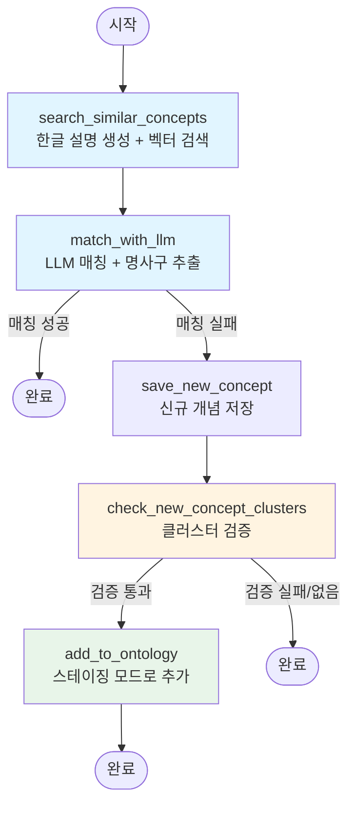

# Ontology Package

온톨로지 관리 패키지. GraphDB를 사용한 그래프 데이터베이스 쿼리 및 문서-온톨로지 매핑 기능을 제공합니다.

## 구조

```
ontology/
├── pyproject.toml
├── README.md
├── setup_graphdb.sh                     # GraphDB 초기 세팅
├── run_document_ontology_mapping.sh     # 메인 실행 스크립트
├── example_input.jsonl                  # 예제 입력 파일
├── data/
│   └── llm_ontology.ttl                 # 초기 온톨로지 스키마 (읽기 전용)
├── backups/                             # Graph DB 백업 (최근 10개)
│   └── graphdb_*.ttl
├── snapshots/                           # ChromaDB 스냅샷 (최근 10개)
│   └── chromadb_v*.tar.gz
├── db/
│   ├── vector_store/                    # ChromaDB 데이터
│   ├── new_concepts.db                  # 신규 개념 임시 저장
│   └── staged_result/                   # 스테이징 결과 저장
│       ├── staging_concepts.json        # 스테이징된 개념 목록
│       └── mapping_results.json         # 매핑 결과
└── src/
    ├── storage/                         # 저장소 계층
    │   ├── graph_query_engine.py       # Graph DB (SPARQL)
    │   ├── vector_store.py              # Vector DB (ChromaDB)
    │   └── new_concept_manager.py       # SQLite (신규 개념 임시 저장)
    ├── pipeline/                       # 처리 파이프라인
    │   ├── document_ontology_mapper.py # LangGraph 워크플로우
    │   ├── concept_matcher.py          # LLM 기반 개념 매칭
    │   ├── ontology_updater.py         # 온톨로지 업데이트 (스테이징 지원)
    │   ├── relation_builder.py         # Source 기반 관계 추가
    │   ├── ontology_graph_manager.py   # NetworkX 기반 그래프 관리
    │   ├── staging_manager.py          # 스테이징 개념 관리
    │   ├── graph_reorganizer.py        # 그래프 재구성 제안
    │   └── graph_exporter.py            # 그래프 구조 export
    ├── backup/                         # 백업/동기화
    │   ├── graph_backup.py             # Graph DB 백업
    │   ├── chromadb_sync.py            # Graph DB ↔ ChromaDB 동기화
    │   └── chromadb_snapshot.py       # ChromaDB 스냅샷 관리
    ├── utils.py                        # 공통 유틸리티 (TTL 파싱 등)
    └── scripts/                        # 실행 스크립트
        ├── main.py                     # JSONL 처리 메인 로직
        ├── initialize_vector_db.py     # Vector DB 초기화
        ├── add_new_concept.py          # 단일 개념 추가
        ├── check_clusters.py           # 클러스터 DB 확인
        └── sync_staging_to_graphdb.py  # 스테이징 → GraphDB 동기화
```

## 주요 기능

### 1. GraphDB 시작 (초기 세팅)

GraphDB 도커 컨테이너를 시작하고 온톨로지를 로드합니다.

```bash
cd dev/packages/ontology
./setup_graphdb.sh
```

두 스크립트 모두 다음 작업을 자동으로 수행합니다:
1. GraphDB 도커 컨테이너 시작 (포트 7200)
2. Repository 생성 (`llm-ontology`)
3. `data/llm_ontology.ttl` 온톨로지 파일 로드
4. 데이터 로드 검증

스크립트 실행 후:
- GraphDB UI: http://localhost:7200
- SPARQL Endpoint: http://localhost:7200/repositories/llm-ontology

컨테이너 관리:
```bash
# 컨테이너 중지
docker stop graphdb-ontology

# 컨테이너 재시작
docker start graphdb-ontology

# 컨테이너 제거
docker rm -f graphdb-ontology
```

### 2. Vector DB 초기화

온톨로지의 모든 개념에 대한 description을 생성하고 Vector DB를 초기화합니다.

```bash
cd dev/packages/ontology
python scripts/initialize_vector_db.py
```

이 스크립트는 다음 작업을 수행합니다:
1. `data/llm_ontology.ttl`에서 모든 개념 로드
2. Description이 비어있는 개념들에 대해 LLM으로 설명 생성
3. TTL 파일에 description 업데이트
4. ChromaDB Vector Store 초기화 및 모든 개념 임베딩 저장

**주의**: 이 작업은 OpenAI API를 사용하므로 `OPENAI_API_KEY` 환경 변수가 설정되어 있어야 합니다.

Vector DB 경로:
- `db/vector_store/` - ChromaDB 데이터 저장 위치

### 3. 새 개념 추가

새로운 개념을 Graph DB, Vector DB, TTL 파일에 동시에 추가합니다.

```bash
cd dev/packages/ontology
python scripts/add_new_concept.py <concept_id> <label> <parent> [--description DESC]
```

예시:
```bash
# Description을 LLM이 자동으로 생성
python scripts/add_new_concept.py "LoRA" "Low-Rank Adaptation" "FineTuning"

# Description을 직접 지정
python scripts/add_new_concept.py "LoRA" "Low-Rank Adaptation" "FineTuning" \
  --description "대규모 언어 모델을 효율적으로 파인튜닝하기 위한 저랭크 어댑테이션 기법"

# TTL 파일 업데이트 생략 (Graph DB와 Vector DB만 업데이트)
python scripts/add_new_concept.py "LoRA" "Low-Rank Adaptation" "FineTuning" --skip-ttl
```

이 스크립트는 다음 작업을 수행합니다:
1. Description 생성 (지정하지 않으면 LLM이 자동 생성)
2. **Graph DB에 추가** (SPARQL INSERT)
3. **Vector DB에 추가** (임베딩 생성 및 저장)
4. **TTL 파일에 추가** (영속성 보장, `--skip-ttl` 옵션으로 생략 가능)

### 4. SPARQL 쿼리

GraphDB에 SPARQL 쿼리를 실행합니다.

```python
from ontology import GraphQueryEngine

engine = GraphQueryEngine("http://localhost:7200/repositories/repo")
result = engine.query("SELECT * WHERE { ?s ?p ?o }")
```

### 5. 백업 및 스냅샷 관리

**자동 백업 (Graph DB + ChromaDB):**
```bash
# run_document_ontology_mapping.sh 실행 시 자동으로 백업
./run_document_ontology_mapping.sh --input concepts.jsonl

# 백업 생략
./run_document_ontology_mapping.sh --input concepts.jsonl --skip-backup
```

백업 파일:
- Graph DB: `backups/graphdb_YYYYMMDD_HHMMSS.ttl` (최근 10개 유지)
- ChromaDB: `snapshots/chromadb_v{N}_YYYYMMDD_HHMMSS.tar.gz` (최근 10개 유지)

**수동 백업/스냅샷:**
```python
from backup import create_backup, create_snapshot

# Graph DB 백업
create_backup("http://localhost:7200/repositories/llm-ontology", "backups")

# ChromaDB 스냅샷
create_snapshot("db/vector_store", "snapshots")
```

**복원:**
```python
from backup import restore_snapshot
restore_snapshot("snapshots/chromadb_v1_20251226.tar.gz", "db/vector_store")
```

### 6. Vector 유사도 검색

Vector DB를 사용하여 유사한 개념을 검색합니다.

```python
from ontology import VectorStore

vector_store = VectorStore("db/vector_store")

results = vector_store.find_similar("attention mechanism", k=5)
for result in results:
    print(f"{result['concept_id']}: {result['description']}")
    print(f"  Distance: {result['distance']}\n")
```

### 7. 스테이징 시스템

신규 개념을 추가할 때 스테이징 모드를 사용하면 실제 DB에 반영하기 전에 확인할 수 있습니다.

**스테이징된 개념 확인:**
```bash
cd dev/packages/ontology
python src/scripts/check_clusters.py --db db/new_concepts.db
```

**스테이징 JSON 파일 확인:**
```bash
cat db/staged_result/staging_concepts.json
```

**스테이징된 개념을 GraphDB에 반영:**
```bash
# JSON 파일에서 반영
python src/scripts/sync_staging_to_graphdb.py \
  --json db/staged_result/staging_concepts.json \
  --graph-endpoint http://localhost:7200/repositories/llm-ontology

# VectorDB 스테이징 컬렉션에서 반영
python src/scripts/sync_staging_to_graphdb.py \
  --vectordb db/vector_store \
  --graph-endpoint http://localhost:7200/repositories/llm-ontology
```

**스테이징 워크플로우:**
1. JSONL 처리 시 신규 개념은 스테이징 모드로 추가됨
2. `db/staged_result/staging_concepts.json`에 스테이징된 개념 목록 저장
3. 사용자가 확인 후 `sync_staging_to_graphdb.py`로 실제 GraphDB에 반영
4. VectorDB 스테이징 컬렉션도 실제 컬렉션으로 커밋

### 8. 클러스터 확인

신규 개념 클러스터링 상태를 확인합니다.

```bash
cd dev/packages/ontology
python src/scripts/check_clusters.py --db db/new_concepts.db
```

출력 정보:
- 신규 개념 수 (`new_concepts` 테이블)
- 클러스터 수 및 각 클러스터의 개념 목록 (`concept_clusters` 테이블)
- 클러스터링 메타데이터 (`clustering_metadata` 테이블)
- 클러스터 크기 통계 (평균, 최소, 최대, 5개 이상 클러스터 수)

### 9. 사용 예시

**테스트 실행:**
```bash
cd dev/packages/ontology

# 예제 JSONL 파일로 테스트
./run_document_ontology_mapping.sh --input example_input.jsonl

# 백업 생략
./run_document_ontology_mapping.sh --input example_input.jsonl --skip-backup
```

**Python 코드에서 사용:**
```python
from storage import GraphQueryEngine, VectorStore
from backup import (
    sync_graphdb_to_chromadb,
    create_backup,
    create_snapshot
)

# 백업
create_backup("http://localhost:7200/repositories/llm-ontology", "backups")

# 동기화
graph_engine = GraphQueryEngine("http://localhost:7200/repositories/llm-ontology")
vector_store = VectorStore("db/vector_store")
sync_graphdb_to_chromadb(graph_engine, vector_store)

# 스냅샷
create_snapshot("db/vector_store", "snapshots")
```

### 10. 문서-온톨로지 매핑 (고급)

```python
from ontology import (
    GraphQueryEngine,
    VectorStore,
    ConceptMatcher,
    NewConceptManager,
    OntologyUpdater,
    DocumentOntologyMapper,
)

# 컴포넌트 초기화
graph_engine = GraphQueryEngine("http://localhost:7200/repositories/repo")
vector_store = VectorStore("path/to/vector_db")
concept_matcher = ConceptMatcher(vector_store)
new_concept_manager = NewConceptManager("path/to/new_concepts.db")
ontology_updater = OntologyUpdater(graph_engine)

# 매퍼 생성
mapper = DocumentOntologyMapper(
    graph_engine=graph_engine,
    vector_store=vector_store,
    concept_matcher=concept_matcher,
    new_concept_manager=new_concept_manager,
    ontology_updater=ontology_updater,
)

# 키워드 매핑
keywords = ["machine learning", "neural network"]
result = mapper.map_keywords(keywords, chunk_id="chunk_001")
```

#### 문서-온톨로지 매핑 워크플로우

`DocumentOntologyMapper`는 LangGraph를 사용하여 문서에서 추출한 개념을 온톨로지에 매핑합니다.

##### 워크플로우 그래프



##### 상태 구조 (MappingState)

```python
{
    "concept": str,                  # 입력 개념 (필수)
    "chunk_text": str,               # 원본 텍스트 (필수)
    "source": str,                   # 출처 (section_id 기반 자동 생성)
    "metadata": Dict[str, Any],      # 추가 메타데이터 (section_id, section_title 등)
    "matched_concept_id": Optional[str],  # 매칭된 개념 ID
    "is_new": bool,                  # 신규 개념 여부
    "candidates": List[Dict],        # 벡터 검색 후보들
    "korean_description": Optional[str],  # LLM이 생성한 한글 설명
    "reason": Optional[str],         # 매칭/비매칭 판단 이유
    "noun_phrase_summary": Optional[str],  # LLM이 추출한 명사구 요약
    "should_add_to_ontology": Optional[bool],  # 온톨로지 추가 여부
    "cluster": Optional[Dict[str, Any]]  # 클러스터 정보 (검증 통과 시)
}
```

**입력 JSONL 필수 필드:**
- `concept`: 개념 이름
- `section_id`: 섹션 ID (관계 생성에 사용)
- `section_title`: 섹션 제목
- `chunk_text`: 원본 텍스트

**입력 JSONL 선택 필드:**
- `source`: 출처 (없으면 `section_{section_id}`로 자동 생성)
- `chapter_id`, `chapter_title`, `book_id`, `book_title` 등

##### 노드별 상세 설명

1. **search_similar_concepts** (벡터 검색)
   - **한글 설명 생성**: 입력 개념에 대해 LLM으로 한글 description 생성 (3-5문장)
     - 개념의 핵심 정의, 주요 특징, 사용 사례, 관련 개념 등을 포함
     - 원본 텍스트(`chunk_text`) 맥락을 고려하여 생성
   - **벡터 검색**: 생성된 한글 설명을 임베딩하여 ChromaDB에서 유사 개념 검색
     - 스테이징 컬렉션 포함 검색 (`include_staging=True`)
     - 상위 5개 후보 개념 추출 (LLMConcept 제외)
   - **결과 저장**: `candidates`에 후보 리스트, `korean_description`에 생성된 설명 저장

2. **match_with_llm** (LLM 매칭)
   - **맥락 기반 매칭**: 개념, chunk_text, 후보 개념들을 LLM에 전달
   - **명사구 추출**: LLM이 개념의 핵심 명사구 요약(`noun_phrase_summary`) 추출
   - **매칭 판단**: 원본 텍스트 맥락을 고려하여 최종 매칭 여부 결정
     - 매칭 성공: `matched_concept_id` 설정, `is_new = False`, 워크플로우 종료
     - 매칭 실패: `is_new = True`, `reason`에 판단 이유 저장, 다음 노드로 진행

3. **save_new_concept** (신규 개념 저장)
   - 매칭 실패한 개념을 신규 개념으로 SQLite DB에 저장
   - 저장 정보:
     - 개념명 (`concept`)
     - 한글 설명 (`korean_description` 또는 `chunk_text` 일부)
     - 출처 (`source`)
     - 원본 키워드 (`original_keyword`)
     - 명사구 요약 (`noun_phrase_summary`)
     - 매칭 실패 이유 (`reason`)
   - 나중에 클러스터링을 위해 임시 보관

4. **check_new_concept_clusters** (클러스터 체크 및 검증)
   - **클러스터 조회**: 신규 개념 DB에서 현재 개념이 포함된 클러스터 조회 (최소 5개)
   - **LLM 클러스터 검증**: 각 클러스터에 대해 LLM으로 다음을 수행:
     - 클러스터 내 모든 개념의 `noun_phrase_summary` 검토
     - 가장 적절한 대표 `noun_phrase_summary` 하나 선택
     - 클러스터의 모든 개념이 선택한 대표 개념과 합쳐질 수 있는지 판단
     - 합칠 수 있다면 통합 description 생성 (3-5문장, 모든 개념 포괄)
   - **대표 개념 선택**: 선택된 `noun_phrase_summary`를 가진 개념을 대표 개념으로 선택
   - **결과 저장**: 검증 통과 시 `should_add_to_ontology = True`, `cluster`에 클러스터 정보 저장

5. **add_to_ontology** (온톨로지 추가)
   - **대표 개념 사용**: LLM이 선택한 대표 개념의 `noun_phrase_summary`를 개념 ID로 사용
   - **부모 개념 결정**: LLM을 사용하여 적절한 부모 개념 결정
   - **스테이징 모드 추가**: 
     - `staging=True`로 Graph DB와 ChromaDB에 임시 추가
     - 스테이징 컬렉션에 임베딩 저장
     - 스테이징 매니저에 메타데이터 저장 (원본 키워드 리스트, 부모 할당 이유 등)
   - **클러스터 제거**: 신규 개념 DB에서 해당 클러스터 삭제
   - **실제 DB 반영**: 스테이징만 수행하고, 실제 DB 반영은 `main.py` 끝에서 일괄 처리

##### 데이터 흐름

```
JSONL 입력 (concept + section_id + section_title + chunk_text + 옵션 필드)
    ↓
각 개념별로:
    ↓
[1. search_similar_concepts]
    - LLM으로 한글 description 생성 (chunk_text 맥락 활용)
    - 한글 description으로 벡터 검색 (스테이징 컬렉션 포함)
    - 상위 5개 후보 개념 추출
    ↓
[2. match_with_llm]
    - LLM이 chunk_text 맥락을 고려하여 매칭 판단
    - 명사구 요약(noun_phrase_summary) 추출
    ↓
매칭 성공 → 완료 (matched_concept_id 설정)
    ↓
매칭 실패 → [3. save_new_concept]
    - 신규 개념 DB에 저장
    - korean_description, noun_phrase_summary, reason 저장
    ↓
[4. check_new_concept_clusters]
    - 현재 개념이 포함된 클러스터 조회 (5개 이상)
    - LLM으로 클러스터 검증:
      * 대표 noun_phrase_summary 선택
      * 클러스터 통합 가능 여부 판단
      * 통합 description 생성
    - 대표 개념 선택
    ↓
검증 통과 → [5. add_to_ontology]
    - 대표 개념의 noun_phrase_summary를 개념 ID로 사용
    - LLM으로 부모 개념 결정
    - 스테이징 모드로 Graph DB + ChromaDB에 임시 추가
    - 스테이징 매니저에 메타데이터 저장
    - 클러스터 삭제
    ↓
검증 실패 또는 클러스터 없음 → 완료
    ↓
모든 개념 처리 완료 후:
    ↓
[스테이징 결과 확인 및 수동 반영]
    - staging_concepts.json 파일 생성
    - 사용자 확인 후 sync_staging_to_graphdb.py 실행
```

##### 핵심 로직 상세 설명

**1. 한글 설명 생성 및 벡터 검색**

입력 개념에 대해 LLM으로 한글 description을 생성하여 벡터 검색의 정확도를 향상시킵니다.

```python
# 한글 설명 생성 예시
입력: concept="LoRA", chunk_text="LoRA는 대규모 언어 모델을 효율적으로..."
생성된 설명: "LoRA(Low-Rank Adaptation)는 대규모 언어 모델을 효율적으로 
파인튜닝하기 위한 기법입니다. 전체 모델 파라미터를 업데이트하는 대신 
저랭크 행렬을 사용하여 학습 가능한 파라미터 수를 대폭 줄입니다. 
이를 통해 메모리 사용량을 크게 감소시키면서도 성능 저하를 최소화할 수 있습니다."
```

- 원본 텍스트(`chunk_text`)의 맥락을 고려하여 생성
- 벡터 검색에 유리하도록 다양한 표현과 키워드 포함
- 스테이징 컬렉션도 함께 검색하여 최신 추가된 개념도 매칭 가능

**2. 명사구 요약 추출**

LLM 매칭 과정에서 개념의 핵심 명사구를 추출하여 클러스터링과 대표 개념 선택에 활용합니다.

```python
# 명사구 요약 예시
입력: "Low-Rank Adaptation technique"
추출된 noun_phrase_summary: "Low-Rank Adaptation"
```

- 클러스터 내 여러 개념의 `noun_phrase_summary`를 비교하여 대표 개념 선택
- 개념 ID로 사용되어 온톨로지에 저장됨

**3. 클러스터 검증 로직**

5개 이상의 개념이 클러스터로 묶였을 때, LLM이 다음을 검증합니다:

1. **대표 noun_phrase_summary 선택**
   - 클러스터 내 모든 개념의 `noun_phrase_summary` 검토
   - 가장 적절한 하나를 대표로 선택

2. **통합 가능 여부 판단**
   - 모든 개념이 동일하거나 매우 유사한 의미를 나타내는가?
   - 개념들 간의 차이가 단순히 표현 방식의 차이인가, 아니면 본질적으로 다른 개념인가?
   - 각각 독립적으로 구분이 필요한 개념은 합치지 않음

3. **통합 description 생성**
   - 클러스터의 모든 개념을 포괄하는 3-5문장 description 생성
   - 각 개념의 description을 종합하여 더 포괄적이고 정확한 설명 작성

**4. 스테이징 모드**

신규 개념을 온톨로지에 추가할 때 스테이징 모드를 사용합니다:

- Graph DB: 실제 DB에 추가하지 않고 스테이징 그래프에만 추가
- ChromaDB: 스테이징 컬렉션에 임베딩 저장 (검색에는 포함되지만 실제 컬렉션과 분리)
- 메타데이터 저장: 원본 키워드 리스트, 부모 할당 이유 등 저장
- 사용자 확인 후 `sync_staging_to_graphdb.py`로 일괄 반영

##### 주요 특징

- **한글 설명 기반 검색**: 
  - 입력 개념에 대해 LLM으로 한글 description을 생성하여 벡터 검색에 활용
  - 원본 텍스트 맥락을 고려하여 더 정확한 설명 생성
  - 벡터 검색 정확도 향상

- **2단계 매칭**: 
  - 1단계: 한글 description으로 벡터 검색 (스테이징 컬렉션 포함)
  - 2단계: LLM이 원본 텍스트 맥락을 고려하여 최종 매칭 판단
  - 명사구 요약(`noun_phrase_summary`) 추출로 개념의 핵심 표현 파악

- **스마트 클러스터 검증**:
  - LLM을 사용하여 클러스터의 개념들을 합칠 수 있는지 검증
  - 대표 `noun_phrase_summary` 선택 및 통합 description 생성
  - 단순 표현 차이가 아닌 본질적으로 다른 개념은 분리

- **대표 개념 선택**:
  - 클러스터 내 여러 개념 중 LLM이 선택한 대표 `noun_phrase_summary`를 개념 ID로 사용
  - 원본 키워드들을 메타데이터로 보존하여 추적 가능

- **신규 개념 관리**: 
  - 매칭 실패한 개념을 임시 저장하고 클러스터링
  - 5개 이상 묶인 클러스터만 온톨로지에 추가

- **스테이징 시스템**: 
  - 신규 개념을 스테이징 모드로 추가하여 확인 후 반영
  - 스테이징 컬렉션과 실제 컬렉션 분리 관리
  - 사용자 확인 후 일괄 반영

- **Section 기반 관계**: 
  - 같은 section_id를 가진 개념들 간 자동으로 related 관계 생성
  - Weight 관리: 동일 관계가 반복되면 weight 증가

- **자동 백업 및 동기화**: 
  - 실행 시마다 Graph DB 자동 백업
  - Graph DB와 ChromaDB 자동 동기화

- **그래프 관리**: 
  - NetworkX 기반 그래프 구조 관리
  - 그래프 재구성 제안 기능 (선택적)

## 개념 관리 워크플로우

### 초기 설정 (처음 한 번만)

1. **환경 설정**
   ```bash
   cd dev/packages/ontology
   uv sync
   
   # Bruno API 사용 시
   export OPENAI_API_BASE="http://bruno.maas.navercorp.com/v1"
   export OPENAI_API_KEY="your-bruno-api-key"
   export OPENAI_MODEL="gpt-4o-mini"  # 선택사항 (기본값: gpt-4o-mini)
   
   # OpenAI API 사용 시
   # export OPENAI_API_KEY="your-openai-api-key"
   # export OPENAI_MODEL="gpt-4o"  # 선택사항
   ```

2. **GraphDB 시작**
   ```bash
   ./setup_graphdb.sh
   ```

3. **Graph DB ↔ ChromaDB 동기화 (초기 설정)**
   ```bash
   ./run_document_ontology_mapping.sh --sync-only
   ```

### JSONL 배치 처리 (권장)

**JSONL 입력 형식:**
```jsonl
{"concept": "LoRA", "section_id": 2, "section_title": "What is an LLM twin?", "chunk_text": "LoRA는 대규모 언어 모델을...", "chapter_id": 6, "chapter_title": "Chapter 1", "book_id": 1}
{"concept": "QLoRA", "section_id": 2, "section_title": "What is an LLM twin?", "chunk_text": "QLoRA는 양자화된...", "chapter_id": 6, "chapter_title": "Chapter 1", "book_id": 1}
```

**필수 필드:**
- `concept`: 개념 이름
- `section_id`: 섹션 ID (같은 section_id의 개념들끼리 related 관계 생성)
- `section_title`: 섹션 제목
- `chunk_text`: 개념이 추출된 원본 텍스트

**선택 필드:** 
- `source`: 출처 (없으면 `section_{section_id}`로 자동 생성)
- `chapter_id`, `chapter_title`: 챕터 정보
- `book_id`, `book_title`: 책 정보
- `key_idea_id`, `chunk_id` 등 기타 메타데이터

**실행:**
```bash
# 기본 실행 (백업 + 동기화 + 처리)
./run_document_ontology_mapping.sh --input concepts.jsonl

# 백업 생략 (Graph DB + ChromaDB)
./run_document_ontology_mapping.sh --input concepts.jsonl --skip-backup

# 동기화만 실행
./run_document_ontology_mapping.sh --sync-only

# 동기화 생략
./run_document_ontology_mapping.sh --input concepts.jsonl --skip-sync
```

**스테이징 확인 및 반영:**
```bash
# 스테이징된 개념 확인
python src/scripts/check_clusters.py --db db/new_concepts.db

# 스테이징 JSON 파일 확인
cat db/staged_result/staging_concepts.json

# 스테이징된 개념을 GraphDB에 반영
python src/scripts/sync_staging_to_graphdb.py \
  --vectordb db/vector_store \
  --graph-endpoint http://localhost:7200/repositories/llm-ontology
```

### 플로우 다이어그램

```
JSONL 입력
    ↓
┌─────────────────────────────────┐
│ 1. Graph DB 백업 (자동)          │
│ 2. Graph DB ↔ ChromaDB 동기화    │
└─────────────────────────────────┘
    ↓
각 개념별 처리:
    ↓
[Vector 유사도 검색]
    ↓
[LLM 매칭 (chunk_text 포함)]
    ↓
매칭 성공 → 완료
    ↓
매칭 실패 → [신규 개념 저장]
    ↓
[클러스터 체크 (5개 이상?)]
    ↓
Yes → [온톨로지에 추가]
    ↓
모든 개념 처리 완료
    ↓
[스테이징 결과 확인]
    ↓
┌─────────────────────────────────┐
│ 스테이징 JSON 파일 저장          │
│ - staging_concepts.json          │
│ - mapping_results.json           │
└─────────────────────────────────┘
    ↓
[사용자 확인 후 수동 반영]
    ↓
sync_staging_to_graphdb.py 실행
    ↓
┌─────────────────────────────────┐
│ Graph DB: 개념 + 관계 저장       │
│ ChromaDB: 임베딩 저장            │
│ Snapshots: 버전 관리 (선택)      │
└─────────────────────────────────┘
```

## 설치

```bash
cd dev/packages/ontology
uv sync
```

## 의존성

- `chromadb>=0.4` - 벡터 DB
- `sentence-transformers>=5.2.0` - 임베딩 모델 (BAAI/bge-m3)
- `langchain>=0.3` - LangChain
- `langgraph` - LangGraph
- `langchain-openai>=1.1.6` - OpenAI 통합
- `langchain-core>=1.2.5` - LangChain 코어
- `rdflib` - RDF 처리
- `SPARQLWrapper` - SPARQL 쿼리
- `psycopg2-binary>=2.9.11` - PostgreSQL 연결
- `docker` - 도커 컨테이너 관리
- `networkx>=3.0` - 그래프 구조 관리
- `numpy>=1.24.0` - 수치 연산
- `scikit-learn>=1.3.0` - 클러스터링

## 주요 특징

### 데이터 관리 전략

1. **Graph DB (단일 진실 소스)**
   - 모든 개념과 관계는 Graph DB에 저장
   - `data/llm_ontology.ttl`은 초기 스키마만 (동적 업데이트 안 함)
   - 실행 시마다 자동 백업 (`backups/` 디렉토리)

2. **ChromaDB (검색 최적화)**
   - Graph DB와 자동 동기화
   - BAAI/bge-m3 모델 사용 (8192 토큰, 100+ 언어)
   - 스냅샷으로 버전 관리 (`snapshots/` 디렉토리)

3. **백업 및 버전 관리**
   - Graph DB: 실행 시마다 TTL export (최근 10개 유지)
   - ChromaDB: 실행 시마다 tar.gz 스냅샷 (최근 10개 유지)
   - 모든 백업/스냅샷은 Git에서 제외 (.gitignore)

4. **스테이징 시스템**
   - 신규 개념은 스테이징 모드로 추가 (임시 저장)
   - `db/staged_result/staging_concepts.json`에 스테이징된 개념 목록 저장
   - 사용자 확인 후 `sync_staging_to_graphdb.py`로 실제 DB에 반영
   - VectorDB 스테이징 컬렉션과 실제 컬렉션 분리 관리

5. **그래프 구조 관리**
   - NetworkX 기반 그래프 구조 관리
   - 실제 그래프와 스테이징 그래프 분리
   - 그래프 재구성 제안 기능 (선택적)
   - 그래프 구조 export (JSON, TTL 형식)

